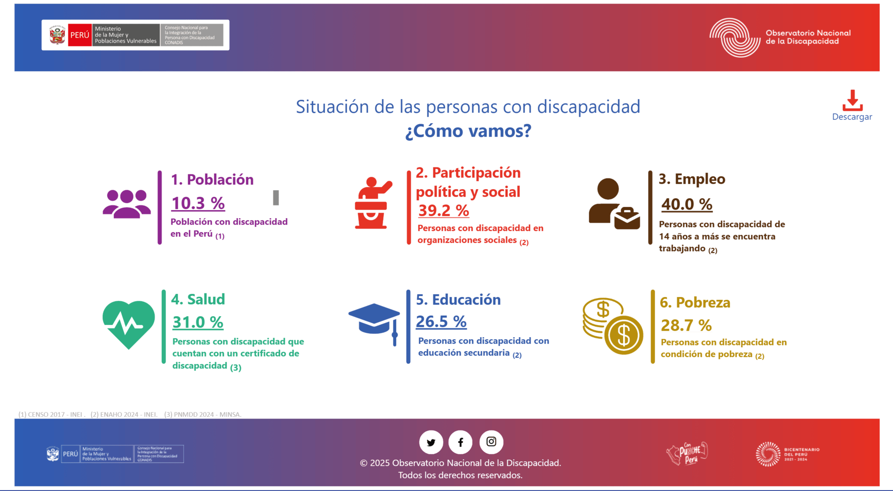
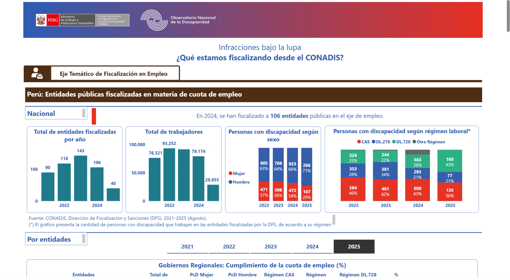
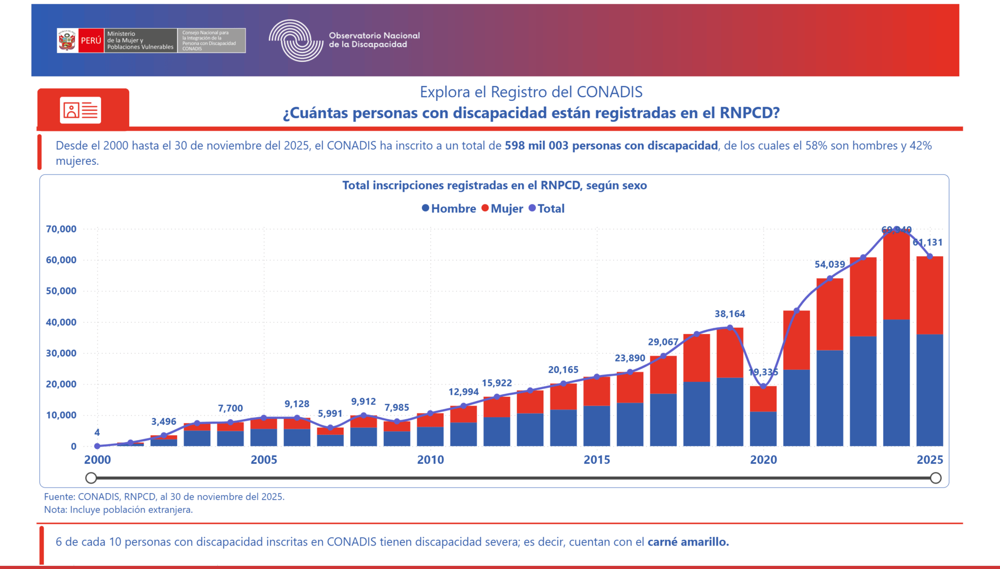
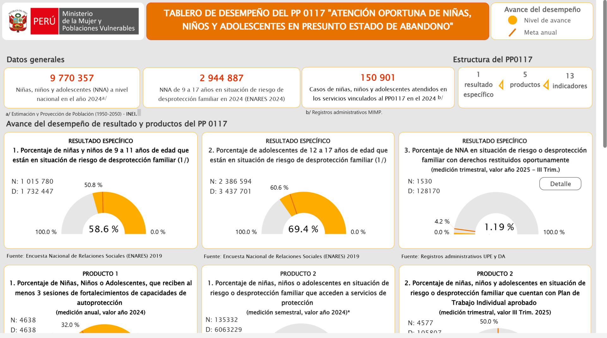
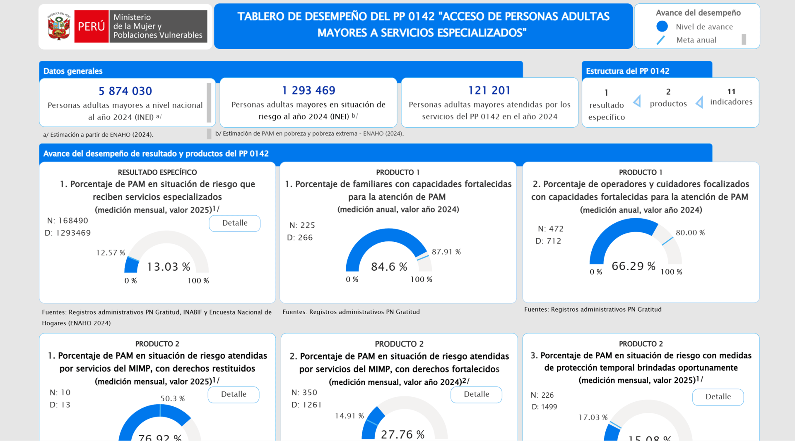

# Proyectos Power BI

## Proyecto Plataforma VISIBLE

**Institución:** Ministerio de la Mujer y Poblaciones Vulnerables - MIMP  
**Rol:** Consultor (Data Scientist)  
**Año:** 2025  
**Herramienta principal:** Power BI, Python, STATA, Git/GitHub  
**Estado:** Control de calidad (etapa de pruebas)

---

### 🎯 Objetivo del Proyecto

Construir/estimar indicadores y desarrollar **dashboards** estadísticos para la sección de indicadores de la nueva [**Plataforma VISIBLE**](https://visible.dansantivanezdev.space/) (un espacio implementado por el MIMP para integrar, estandarizar y organizar los observatorios del sector), orientados a consolidar información oficial y facilitar la toma de decisiones, la planificación de políticas públicas y la transparencia institucional.

🔗 [Plataforma VISIBLE](https://visible.dansantivanezdev.space/observatorios/discapacidad/estadisticas) (fase prueba)

---

### 🧮 Estructura del proyecto
Organización del proyecto orientada a reproducibilidad, control de versiones y carga en Power BI:

```cmd
├───01_data/
│   ├───01_raw/
│   └───02_processed/
├───02_code/
├───03_doc/
├───04_results/
│   ├───01_wide/
│   ├───02_long/
│   └───03_carga_bi/
├───05_report/
│   
├───.gitignore
├───overview-noshare.tex
├───README-noshare.md
└───requirements.txt
```

---

### 📌 Indicadores Clave (KPIs) por Temática

Indicadores organizados por temáticas poblacionales:  
- Niñas, Niños y Adolescentes (NNA)  
- Personas con Discapacidad (PCD)  
- Personas Adultas Mayores (PAM)  
- Violencia  
- Familias  

Dimensiones de análisis:  
- Salud
- Educación
- Empleo
- Ingresos
- Relaciones familiares

Principales desagregaciones:
- Periodo: 2019 – 2024
- Área de residencia: Urbano / Rural
- Región: 26 departamentos (incluye Lima metropolitana)

---

### 📈 Dashboard (Power BI)
[Ver](https://visible.dansantivanezdev.space/observatorios/discapacidad/estadisticas)

> Los dashboards permiten filtros dinámicos por periodo, región, área de residencia y características poblacionales.

---

## Proyecto Observatorio Nacional de la Discapacidad

**Institución:** Consejo Nacional para la Integración de la Persona con Discapacidad - CONADIS  
**Rol:** Consultor (Data Scientist)  
**Año:** 2024 | 2025  
**Herramienta principal:** Power BI, Python, STATA, Git/GitHub, VSCode  
**Estado:** En producción

---

### 🎯 Objetivo del Proyecto

Construir/estimar indicadores y desarrollar **dashboards** estadísticos para la sección [**Discapacidad en cifras**](https://observatorio.conadisperu.gob.pe/discapacidad-en-cifras/) del **Observatorio Nacional de la Discapacidad** una plataforma orientada a brindar información relevante, confiable, oportuna, amigable y accesible en materia de
discapacidad para las entidades públicas, centros de investigación, entre otros.

🔗 [Observatorio Nacional de la Discapacidad](https://observatorio.conadisperu.gob.pe/)

---

### 🧮 Estructura del proyecto
Organización del proyecto orientada a reproducibilidad, control de versiones y carga en Power BI:

```cmd
/DISCAPACIDAD EN CIFRAS 2025/
│ 
├───1 - ENAHO
│   ├───1 - DATA
│   │   ├───1 - DATA RAW
│   │   └───2 - DATA CLEAN
│   ├───2 - CODIGO
│   ├───3 - TABULADOS
│   ├───4 - CARGA BI
│   └───5 - REPORTE BI
├───2 - FISCALIZACION
│   ├───1 - DATA
│   │   ├───1 - DATA RAW
│   │   └───2 - DATA CLEAN
│   ├───2 - CODIGO
│   ├───3 - TABULADOS
│   ├───4 - CARGA BI
│   └───5 - REPORTE BI
├───3 - REGISTRO
│   ├───1 - DATA
│   │   ├───1 - DATA RAW
│   │   └───2 - DATA CLEAN
│   ├───2 - CODIGO
│   ├───3 - TABULADOS
│   ├───4 - CARGA BI
│   └───5 - REPORTE BI
├───4 - SECTORES
│   ├───1 - DATA
│   │   ├───1 - DATA RAW
│   │   └───2 - DATA CLEAN
│   ├───2 - CODIGO
│   ├───3 - TABULADOS
│   ├───4 - CARGA BI
│   └───5 - REPORTE BI
├───.gitignore
├───overview-noshare.tex
├───requirements.txt        # Dependencias del proyecto
├───README.md               # Documentación
└───.venvCONADIS            # Entorno virtual
```
🔗 [Documentación técnica](documentacion.pdf)

---

### 📌 Indicadores (KPIs)

Dashboards organizados por temáticas:
- Situación de las personas con discapacidad: ¿Cómo vamos?  
- Infracciones bajo la lupa: ¿Qué estamos fiscalizando?  
- Explora el Registro del CONADIS: ¿Cuántas personas con discapacidad están registradas en el RNPCD?   

Dimensiones de análisis:  
- Sociodemográfico  
- Participación política y social  
- Empleo e ingresos  
- Salud  
- Educación  
- Pobreza  

Principales desagregaciones:
- Periodo: 2014 – 2024
- Área de residencia: Urbano / Rural
- Región: 26 departamentos (incluye Lima metropolitana)
- Características demográficas.

---

### 📈 Dashboard (Power BI)
#### **Situación de las personas con discapacidad: ¿Cómo vamos?**  
[Ver](https://app.powerbi.com/view?r=eyJrIjoiYmRmM2UyMzAtMzkzMy00MWE2LTlmYmQtMjZjMDI0OGZlYzAzIiwidCI6IjA5OTJkMDkyLTIyZDktNDVhOC05M2EwLTY3NTY4ZGMzMDY4MiIsImMiOjR9)



#### **Infracciones bajo la lupa: ¿Qué estamos fiscalizando?**   
[Ver](https://app.powerbi.com/view?r=eyJrIjoiNDU3ZDBjYWEtODBiMi00OGZiLWIzNGQtZmNlZjA1ZGZmMWIxIiwidCI6IjA5OTJkMDkyLTIyZDktNDVhOC05M2EwLTY3NTY4ZGMzMDY4MiIsImMiOjR9)



#### **Explora el Registro del CONADIS: ¿Cuántas personas con discapacidad están registradas en el RNPCD?**   
[Ver](https://app.powerbi.com/view?r=eyJrIjoiNmJjYTIyMTQtOTY4Mi00YTYxLTg1MzgtYWFjODk4ZmQwZWI3IiwidCI6IjA5OTJkMDkyLTIyZDktNDVhOC05M2EwLTY3NTY4ZGMzMDY4MiIsImMiOjR9)



> Los dashboards permiten filtros dinámicos por periodo, región, área de residencia y características poblacionales.


## Otros Proyectos 

**Proyecto:** Estadisticas MIMP  
**Rol:** Data Analyst 
**Año:** 2021 | 2022  
**Herramienta principal:** Power BI  
**Estado:** En producción

---

### 🎯 Objetivo del Proyecto

Implementar **dashboards** estadísticos para la sección [**Estadísticas MIMP**](https://www.mimp.gob.pe/omep/estadisticas-tablero-desempenio-NNA.php) para el seguimiento de indicadores y rendición de cuentas sobre los Programas Presupuestales.

🔗 [Estadísticas MIMP](https://www.mimp.gob.pe/omep/estadisticas-mimp.php)

---

### 📈 Dashboard (Power BI)
#### **Programa Presupuestale 117:** Niñas, Niños y Adolescentes (NNA)  
[Ver](https://app.powerbi.com/view?r=eyJrIjoiODA0YmY2OTEtYTE2ZC00NjM0LWFkYWItOWQ1NWQwMmUwN2RjIiwidCI6IjY4MTljNDYzLTVkZWItNDA3MC1hY2I2LTlmZGQzY2FhZTk4NCJ9)



#### **Programa Presupuestale 142:** Personas Adultas Mayores (PAM)   
[Ver](https://app.powerbi.com/view?r=eyJrIjoiMjI1NzJiZGYtMGYzYi00MDAwLTg3ODgtMDk4ZTJhOTU2MDNlIiwidCI6IjY4MTljNDYzLTVkZWItNDA3MC1hY2I2LTlmZGQzY2FhZTk4NCJ9)


